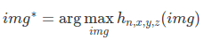
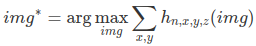

# Neural Network Interpretation

Để có thể đưa ra dự đoán, dữ liệu đầu vào được truyền thông qua nhiều lớp (layers) bao gồm các phép nhân ma trận giữ dữ
liệu và các trọng số mà model đã học được (learned weights) và thông qua các phép biến đổi phi tuyến tính (non-linear 
transformations)

Để có thể hiểu được hành vi mà model đưa ra quyết định, ta cần có phương pháp để hiểu model:
1. Mạng Neural Net học các features và concepts bên trong những lớp ẩn của nó và ta cần một tool đặc biệt để có thể xem xét
chúng
2. Tín hiệu gradient truyền ngược có thể sử dụng để hiểu model. 

Các kỹ thuật được áp dụng như sau:
* Learned Features: Những features nào mà network đã học được ?
* Pixel Attribution (Saliency Maps): Các pixel đóng góp như thế nào vào việc đưa ra quyết định của model ?
* Concepts: Những concept trừu tượng nào mà Neural Net đã học ? 
* Adversarial Examples: Làm cách nào ta có thể đánh lừa được Neural Network
* Influential Instances: ???

## Learned Features 

Với CNN, ảnh được đưa vào mạng ở dạng raw (pixels). Mạng sẽ biến đổi hình ảnh này nhiều lần. Đầu tiên, ảnh sẽ thông qua 
nhiều lớp convolutional layers. Bên trong các lớp đó, mạng sẽ học được nhiều thứ và bắt đầu tăng dần mức độ phức tạp của 
mà nó học được. Cuối cùng thông tin hình ảnh sau khi biến đổi bởi model sẽ thông qua lớp Fully connected layers và 
sẽ chuyển thành dự đoán. 

* Những tầng đầu tiên của CNN học những đặc trưng như là cạnh hoặc là các mẫu đơn giản.
* Những tầng sâu hơn học những mẫu phức tạp hơn.
* Tầng sâu nhất của CNN học các đặc trưng như là toàn bộ hay là một phần của vật thể.
* Tầng fully connected layers học cách kết nối các activations từ các features nhiều chiều về các lớp cần được phân tách.

Các cách để có thể chứng minh cho những điều nói ở trên:

### Feature Visualization

Đây là cách tiếp cận trực tiếp. Việc trực quan các đặc trưng tại một đơn vị của Neural Network được hiểu là tìm một 
đầu vào sao cho nó làm đơn vị đó cho ra mức độ activation cao nhất. 

Đơn vị (unit) ở đây được hiểu là các neuron đơn lẻ, các kênh (channels hoặc là feature maps), toàn bộ các lớp của tầng 
cuối của bộ Classification (hoặc tương đương là bộ feature trước khi qua pre-softmax để map sang probability).

Các neuron là đơn vị của mạng lưới, vì thế ta có thể có được thông tin nhiều nhất khi tạo bộ feature visualizations cho 
từng neuron. Nhưng có một vấn đề xảy ra: Neural network thông thường bao gồm hàng triệu neurons. Việc nhìn vào từng neuron 
sẽ tốn thời gian. Channel (thường gọi là activation maps - là kết quả của việc slide 1 Neuron trên toàn bộ input) là một 
lựa chọn tốt hơn cho feature visualization. Ta có thể tiến thêm một mức xa hơn đó là visualize toàn bộ lớp convolutional

#### Feature Visualization through Optimization

Feature visualization là bài toán về tối ưu. Ta giả thiết là toàn bộ trọng số trong neural network được fix cố định, 
điều đó có nghĩa là network đã được huấn luyện trước đó rồi. Ta sẽ tìm tấm ảnh cho phép maximize activation của một đơn
vị.

Đối với việc tối ưu ảnh sao cho maximize output của một đơn vị neuron, ta có công thức: 

Hàm h chính là activation của neuron, img là input của mạng (hình) ảnh, x, y mô tả vị trí mà neuron đang thực hiện tích 
chập, n là chỉ số của layer và z là chỉ số của channel. 

Đối với trường hợp mục tiêu cần tối ưu là toàn bộ channel z trong layer n, thì ta sẽ tối ưu activation: 

Trong công thức trên, toàn bộ neuron đều có trọng số như nhau. Ngoài ra ta có thể random chọn một bộ số ngẫu nhiên theo 
các hướng khác nhau, bao gồm cả hướng âm. Thay vì maximize activation, ta có thể minimize chúng (điều này tương tụ với 
maximizing theo hướng âm)

Có 2 hướng để tạo ra ảnh input:

* Cách đầu tiên là sử dụng lại ảnh trong dữ liệu train, tìm những tấm cho phép maximize activation. Đây là cách tiếp cận hợp lệ,
nhưng sử dụng dữ liệu huấn luyện có một vấn đề là các phần tử trong hình có thể tương quan với nhau và chúng ta không thể
thấy mạng neuron đang thực sự tìm kiếm điều gì.

* Cách thứ hai là tạo ra một ảnh mới, bắt đầu từ một random noise. Để có thể tạo được một hình ảnh minh họa có ý nghĩa, 
ta phải thêm một vài yêu cầu: chỉ những thay đổi nhỏ mới được phép. Để có thể giảm thiểu được noise trong ảnh, ta có thể 
áp dụng jittering, rotation hoặc là scale với ảnh trước khi áp dụng optimization. 

### Connection to Adversarial Examples 

Có sự liên quan giữa feature visualization và adversarial. Cả hai kỹ thuật đều cực đại kích hoạt của đơn vị neuron. Đối 
với adversarial, ta tìm cách maximize activation cho lớp đối thủ (incorrect) class. Một điểm khác nữa đó là khởi tạo ban
đầu: với Adversarial, đó là tấm ảnh chúng ta muốn làm fool model. Đối với feature visualization, nó phụ thuộc vào cách 
tiếp cận, có thể là random noise. 

## Network Dissection

Phần này chưa đụng tới. 
