# Neural Network Interpretation

Để có thể đưa ra dự đoán, dữ liệu đầu vào được truyền thông qua nhiều lớp (layers) bao gồm các phép nhân ma trận giữ dữ
liệu và các trọng số mà model đã học được (learned weights) và thông qua các phép biến đổi phi tuyến tính (non-linear 
transformations)

Để có thể hiểu được hành vi mà model đưa ra quyết định, ta cần có phương pháp để hiểu model:
1. Mạng Neural Net học các features và concepts bên trong những lớp ẩn của nó và ta cần một tool đặc biệt để có thể xem xét
chúng
2. Tín hiệu gradient truyền ngược có thể sử dụng để hiểu model. 

Các kỹ thuật được áp dụng như sau:
* [Learned Features](#learned-features): Những features nào mà network đã học được ?
* [Pixel Attribution (Saliency Maps)](#pixel-attribution-saliency-maps): Các pixel đóng góp như thế nào vào việc đưa ra quyết định của model ?
  * [Vanilla Gradient](#vanilla-gradient-saliency-maps)
  * [DeconvNet](#deconvnet)
  * [Guided Backpropagation](#guided-backpropagation)
  * [Grad-CAM](#grad-cam)
  * [Guided Grad-CAM](#guided-grad-cam)
  * [SmoothGrad](#smoothgrad)
  * [Layer-Wise Relevance Propagation](#layer-wise-relevance-propagation-lrp) 
* [Concepts](#detecting-concepts): Những concept trừu tượng nào mà Neural Net đã học ? 
* [Adversarial Examples](): Làm cách nào ta có thể đánh lừa được Neural Network
* [Influential Instances](): ???


## Learned Features 

Với CNN, ảnh được đưa vào mạng ở dạng raw (pixels). Mạng sẽ biến đổi hình ảnh này nhiều lần. Đầu tiên, ảnh sẽ thông qua 
nhiều lớp convolutional layers. Bên trong các lớp đó, mạng sẽ học được nhiều thứ và bắt đầu tăng dần mức độ phức tạp của 
mà nó học được. Cuối cùng thông tin hình ảnh sau khi biến đổi bởi model sẽ thông qua lớp Fully connected layers và 
sẽ chuyển thành dự đoán. 

* Những tầng đầu tiên của CNN học những đặc trưng như là cạnh hoặc là các mẫu đơn giản.
* Những tầng sâu hơn học những mẫu phức tạp hơn.
* Tầng sâu nhất của CNN học các đặc trưng như là toàn bộ hay là một phần của vật thể.
* Tầng fully connected layers học cách kết nối các activations từ các features nhiều chiều về các lớp cần được phân tách.

Các cách để có thể chứng minh cho những điều nói ở trên

### Feature Visualization

Đây là cách tiếp cận trực tiếp. Việc trực quan các đặc trưng tại một đơn vị của Neural Network được hiểu là tìm một 
đầu vào sao cho nó làm đơn vị đó cho ra mức độ activation cao nhất. 

Đơn vị (unit) ở đây được hiểu là các neuron đơn lẻ, các kênh (channels hoặc là feature maps), toàn bộ các lớp của tầng 
cuối của bộ Classification (hoặc tương đương là bộ feature trước khi qua pre-softmax để map sang probability).

Các neuron là đơn vị của mạng lưới, vì thế ta có thể có được thông tin nhiều nhất khi tạo bộ feature visualizations cho 
từng neuron. Nhưng có một vấn đề xảy ra: Neural network thông thường bao gồm hàng triệu neurons. Việc nhìn vào từng neuron 
sẽ tốn thời gian. Channel (thường gọi là activation maps - là kết quả của việc slide 1 Neuron trên toàn bộ input) là một 
lựa chọn tốt hơn cho feature visualization. Ta có thể tiến thêm một mức xa hơn đó là visualize toàn bộ lớp convolutional

#### Feature Visualization through Optimization

Feature visualization là bài toán về tối ưu. Ta giả thiết là toàn bộ trọng số trong neural network được fix cố định, 
điều đó có nghĩa là network đã được huấn luyện trước đó rồi. Ta sẽ tìm tấm ảnh cho phép maximize activation của một đơn
vị.

Đối với việc tối ưu ảnh sao cho maximize output của một đơn vị neuron, ta có công thức: 


Hàm h chính là activation của neuron, img là input của mạng (hình) ảnh, x, y mô tả vị trí mà neuron đang thực hiện tích 
chập, n là chỉ số của layer và z là chỉ số của channel. 

Đối với trường hợp mục tiêu cần tối ưu là toàn bộ channel z trong layer n, thì ta sẽ tối ưu activation: 

```text
Bài toán tối ưu trên có thể hiểu như sau:
* Mục tiêu là tối ưu (maximize) output của các đơn vị mà ta muốn visual
* Để làm được như vậy thì ta sẽ điều chỉnh ảnh đầu vào dần dần sao cho output của các đơn vị đó là lớn nhất
* Ở đây tham số cần điều chỉnh đó chính là giá trị của từng pixel trong ảnh kết quả. 
* Để có thể điều chỉnh thì ta sẽ tính toán đạo hàm từng phần của gía trị Loss w.r.t theo các giá trị pixel đó
* Pytorch sử dụng cơ chế Autograd để có thể thực hiện được việc đó.
```


Trong công thức trên, toàn bộ neuron đều có trọng số như nhau. Ngoài ra ta có thể random chọn một bộ số ngẫu nhiên theo 
các hướng khác nhau, bao gồm cả hướng âm. Thay vì maximize activation, ta có thể minimize chúng (điều này tương tụ với 
maximizing theo hướng âm)

Có 2 hướng để tạo ra ảnh input:

* Cách đầu tiên là sử dụng lại ảnh trong dữ liệu train, tìm những tấm cho phép maximize activation. Đây là cách tiếp cận hợp lệ,
nhưng sử dụng dữ liệu huấn luyện có một vấn đề là các phần tử trong hình có thể tương quan với nhau và chúng ta không thể
thấy mạng neuron đang thực sự tìm kiếm điều gì.

* Cách thứ hai là tạo ra một ảnh mới, bắt đầu từ một random noise. Để có thể tạo được một hình ảnh minh họa có ý nghĩa, 
ta phải thêm một vài yêu cầu: chỉ những thay đổi nhỏ mới được phép. Để có thể giảm thiểu được noise trong ảnh, ta có thể 
áp dụng jittering, rotation hoặc là scale với ảnh trước khi áp dụng optimization. 

### Connection to Adversarial Examples 

Có sự liên quan giữa feature visualization và adversarial. Cả hai kỹ thuật đều cực đại kích hoạt của đơn vị neuron. Đối 
với adversarial, ta tìm cách maximize activation cho lớp đối thủ (incorrect) class. Một điểm khác nữa đó là khởi tạo ban
đầu: với Adversarial, đó là tấm ảnh chúng ta muốn làm fool model. Đối với feature visualization, nó phụ thuộc vào cách 
tiếp cận, có thể là random noise. 


### Implementation, Result and Evaluation
#### 1. Implementation
Code của cái này được mình code dựa vào kiến thức đã có ở trên, và mình sử dụng **Pytorch Framework** để cài đặt quá trình 
Optimization ảnh đầu vào để được ảnh mô tả feature mà đơn vị của mạng đã được huẩn luyện từ trước học được (khái niệm 
học được ở đây có nghĩa là tín hiệu sẽ cho ra cao - đối với những đầu vào mà đơn vị đó đã học được để nhận biết mẫu 
hoặc bộ phận hay họa tiết ...)

#### 2. Usage

Code của mình đã cho phép visualize các loại features dựa vào các tiêu chí mà ta muốn tối ưu: Neuron (Đang cài đặt), 
Channel (Một feature map), Class Logits (Các neurons ở lớp Pre Softmax) - (Còn Layer (DeepDream) và Class Probability là 
chưa viết). 

Ta có thể sử dụng bất kỳ model nào từ package ```torchvision.models```

Code sẽ được chạy từ script ```main.py```. 

Ví dụ mẫu, ta áp dụng Model VGG16 có kiến trúc như sau:

```
VGG(
  (features): Sequential(
    (0): Conv2d(3, 64, kernel_size=(3, 3), stride=(1, 1), padding=(1, 1))
    (1): ReLU(inplace=True)
    (2): Conv2d(64, 64, kernel_size=(3, 3), stride=(1, 1), padding=(1, 1))
    (3): ReLU(inplace=True)
    (4): MaxPool2d(kernel_size=2, stride=2, padding=0, dilation=1, ceil_mode=False)
    (5): Conv2d(64, 128, kernel_size=(3, 3), stride=(1, 1), padding=(1, 1))
    (6): ReLU(inplace=True)
    (7): Conv2d(128, 128, kernel_size=(3, 3), stride=(1, 1), padding=(1, 1))
    (8): ReLU(inplace=True)
    (9): MaxPool2d(kernel_size=2, stride=2, padding=0, dilation=1, ceil_mode=False)
    (10): Conv2d(128, 256, kernel_size=(3, 3), stride=(1, 1), padding=(1, 1))
    (11): ReLU(inplace=True)
    (12): Conv2d(256, 256, kernel_size=(3, 3), stride=(1, 1), padding=(1, 1))
    (13): ReLU(inplace=True)
    (14): Conv2d(256, 256, kernel_size=(3, 3), stride=(1, 1), padding=(1, 1))
    (15): ReLU(inplace=True)
    (16): MaxPool2d(kernel_size=2, stride=2, padding=0, dilation=1, ceil_mode=False)
    (17): Conv2d(256, 512, kernel_size=(3, 3), stride=(1, 1), padding=(1, 1))
    (18): ReLU(inplace=True)
    (19): Conv2d(512, 512, kernel_size=(3, 3), stride=(1, 1), padding=(1, 1))
    (20): ReLU(inplace=True)
    (21): Conv2d(512, 512, kernel_size=(3, 3), stride=(1, 1), padding=(1, 1))
    (22): ReLU(inplace=True)
    (23): MaxPool2d(kernel_size=2, stride=2, padding=0, dilation=1, ceil_mode=False)
    (24): Conv2d(512, 512, kernel_size=(3, 3), stride=(1, 1), padding=(1, 1))
    (25): ReLU(inplace=True)
    (26): Conv2d(512, 512, kernel_size=(3, 3), stride=(1, 1), padding=(1, 1))
    (27): ReLU(inplace=True)
    (28): Conv2d(512, 512, kernel_size=(3, 3), stride=(1, 1), padding=(1, 1))
    (29): ReLU(inplace=True)
    (30): MaxPool2d(kernel_size=2, stride=2, padding=0, dilation=1, ceil_mode=False)
  )
  (avgpool): AdaptiveAvgPool2d(output_size=(7, 7))
  (classifier): Sequential(
    (0): Linear(in_features=25088, out_features=4096, bias=True)
    (1): ReLU(inplace=True)
    (2): Dropout(p=0.5, inplace=False)
    (3): Linear(in_features=4096, out_features=4096, bias=True)
    (4): ReLU(inplace=True)
    (5): Dropout(p=0.5, inplace=False)
    (6): Linear(in_features=4096, out_features=1000, bias=True)
  )
)
```

Nếu ta muốn visual cho đơn vị là Channel tại Filter thứ 10 của Layer Conv2d (28) của model thì ta sẽ set các tham số như sau:
```
layer = "features.28"
filter = 9
```

Nếu ta muốn visual cho đơn vị là Neuron đại diện cho Class 1 (goldfish) của ImageNet tại lớp Pre Softmax thì ta sẽ thực
hiện điều chỉnh tham số như sau (assume ta đang sử dụng model VGG16)

``` 
layer = "classifier.6"
filter = 1
```

#### 3. Results

##### 3.1. Channel objective (Channel as Unit)

Ở đây mình sử dụng model VGG16 để visualize, cách gọi đơn vị phụ thuộc vào cái mô hình model trong Pytorch

| Đơn vị         | Ảnh Feature tại đó                           |
|----------------|----------------------------------------------|
| Layer(0)[63]   |    |
| Layer(12)[3]   |    |
| Layer(12)[105] |  |
| Layer(12)[181] |  |
| Layer(12)[231] |  |
| Layer(14)[181] |  |
| Layer(19)[54]  |   |
| Layer(21)[54]  |   |
| Layer(24)[54]  |   |
| Layer(26)[1]   |    |
| Layer(26)[54]  |   |
| Layer(26)[200] |  |
| Layer(28)[54]  |   |
| Layer(28)[264] |  |
| Layer(28)[265] |  |
| Layer(28)[266] |  |
| Layer(28)[462] |  |

##### 3.2. Class Logits objective (Class Logits as Unit)

Ở đây mình sử dụng model VGG19 để visualize: (Cái này để sau mình đẩy ảnh lên, mất tiêu cmnr)

| Đơn vị                 | Class trong ImageNet                                                           | Ảnh Feature tại đây                            |
|------------------------|--------------------------------------------------------------------------------|------------------------------------------------|
| Layer(classifier)[1]   | goldfish, Carassius auratus                                                    |    |
| Layer(classifier)[3]   | tiger shark, Galeocerdo cuvieri                                                |    |
| Layer(classifier)[7]   | cock                                                                           |    |
| Layer(classifier)[30]  | bullfrog, Rana catesbeiana                                                     |   |
| Layer(classifier)[37]  | box turtle, box tortoise                                                       |   |
| Layer(classifier)[48]  | Komodo dragon, Komodo lizard, dragon lizard, giant lizard, Varanus komodoensis |   |
| Layer(classifier)[49]  | African crocodile, Nile crocodile, Crocodylus niloticus                        |   |
| Layer(classifier)[71]  | scorpion                                                                       |   |
| Layer(classifier)[76]  | tarantula                                                                      |   |
| Layer(classifier)[79]  | centipede                                                                      |   |
| Layer(classifier)[92]  | bee eater                                                                      |   |
| Layer(classifier)[99]  | goose                                                                          |   |
| Layer(classifier)[105] | koala, koala bear, kangaroo bear, native bear, Phascolarctos cinereus          |  |
| Layer(classifier)[107] | jellyfish                                                                      |  |
| Layer(classifier)[285] | Egyptian cat                                                                   |  |
| Layer(classifier)[301] | ladybug, ladybeetle, lady beetle, ladybird, ladybird beetle                    |  |
| Layer(classifier)[309] | bee                                                                            |  |
| Layer(classifier)[316] | cicada, cicala                                                                 |  |
| Layer(classifier)[403] | aircraft carrier, carrier, flattop, attack aircraft carrier                    |  |
| Layer(classifier)[417] | balloon                                                                        |  |
| Layer(classifier)[445] | bikini, two-piece                                                              |  |
| Layer(classifier)[485] | CD player                                                                      |  |
| Layer(classifier)[488] | chain                                                                          |  |
| Layer(classifier)[492] | chest                                                                          |  |
| Layer(classifier)[508] | computer keyboard, keypad                                                      |  |
| Layer(classifier)[531] | digital watch                                                                  |  |
| Layer(classifier)[562] | fountain                                                                       |  |
| Layer(classifier)[605] | iPod                                                                           |  |
| Layer(classifier)[629] | lipstick, lip rouge                                                            |  |
| Layer(classifier)[657] | missile                                                                        |  |
| Layer(classifier)[805] | soccer ball                                                                    |  |
| Layer(classifier)[879] | umbrella                                                                       |  |
| Layer(classifier)[971] | bubble                                                                         |  |
| Layer(classifier)[987] | corn                                                                           |  |

#### 4. Evaluation

Để kiểm tra tính đúng đắn cho quá trình Optimization, ta thử feed ảnh được Optimized sẵn cho mỗi class của VGG19 ở trên 
vào trong script ```main.py``` của thư mục ```CheckingModelPrediction```:

Đối với class: umbrela , ta feed vào model ảnh: 

```python
Prediction of VGG model 
Class: umbrella 
Percentage: 99.99665069580078
```

Đối với class: goldFish, ta feed vào model ảnh:

```python 
Prediction of VGG model 
Class: goldfish, Carassius auratus 
Percentage: 100.0
```

### Network Dissection

Phần này chưa đụng tới. 


## Pixel Attribution (Saliency Maps)

Pixel attribution methods (phương pháp liên quan đến sự phân bổ của pixel) làm nổi bật các pixel trong ảnh đầu vào có 
liên quan đến một lớp phân loại ảnh nhất định trong mạng thần kinh. 

Pixel attribution methods còn có nhiều tên gọi khác nhau: Sensitivity map, saliency map, pixel attribution map, gradient-based 
attribution methods, feature relevance, feature attribution và feature contribution.

Pixel attribution là một trường hợp đặc biệt của feature attribution, áp dụng đối với ảnh. Feature attribution giải thích
các dự đoán riêng lẻ bằng cách phân bổ từng tính năng vào (input feature) theo mức độ mà nó đã thay đổi dự đoán (tiêu cực hoặc tích 
cực). Features ở đây có thể là input pixels, bảng biểu hoặc là các từ ...

Có 2 kiểu của phương pháp attribution:

* **Occlusion-or pertubation-based**: Cái này chưa đụng tới
* **Gradient-based**: Rất nhiều phương pháp tính toán gradient của prediction (hoặc là classification score) w.r.t input
features. Các phương pháp liên quan đến Gradient-based đa phần khác nhau ở cách mà gradient được tính toán. 

Cả hai cách tiếp cận này đều có điểm chung đó là kết quả tạo ra có cùng kích thước đối với lại ảnh đầu vào, và chúng gán cho mỗi pixel
một giá trị có thể được hiểu là mức độ liên quan của pixel đối với dự đoán hoặc phân loại của hình ảnh đó. 


Ta sử dụng các ký hiệu như sau, ta có một mạng neuron có đầu ra dự đoán là một vector có chiều dài là C. Đầu ra từ mạng cho 
ảnh đầu vào I được gọi là S(I) và: 


Tất cả các phương pháp nhận đầu vào là  
(có thể là image pixels, tabular data, words, ...) với p features và đầu ra của thuật toán là sự giải thích cho các 
mức độ đóng góp của từng điểm đầu vào cho dự đoán: . 
Chỉ số c thể hiện cho class mà ta muốn visualize.

### Vanilla Gradient (Saliency Maps)

Ý tưởng về Vanilla Gradient được giới thiệu bởi Simonyan vào năm 2013. Đối với phương pháp này, ta sẽ tính toán gradient 
của hàm mất mát đối với lớp mà ta muốn visual w.r.t input pixels. Việc này tạo ra một map với kích thước tương đương với 
input features với các giá trị từ âm đến dương. 

Cách thực hiện của phương pháp này đó là: 
1. Thực hiện forward pass đối với ảnh mà ta muốn thực hiện
2. Tính toán gradient của lớp muốn visualize w.r.t với lại input pixels: 

&nbsp;&nbsp;&nbsp;&nbsp;&nbsp;&nbsp;&nbsp;

Ở đây ta thiết lập các class khác về 0
3. Visualize gradients. Ta có thể visual giá trị tuyệt đối hoặc highlight giá trị gradient âm lẫn dương.

Nói cách khác, ta có ảnh đầu vào I và mạng neuron tạo ra Score S_c(I) cho lớp c. Đó là kết quả của một hàm phi tuyến khi
áp dụng vào hình .ảnh Ý tưởng đằng sau việc sử dụng gradient đó là ta có thể xấp xỉ điểm số đó bằng cách sử dụng khai 
triển Taylor bậc 1: 

&nbsp;&nbsp;&nbsp;&nbsp;&nbsp;&nbsp;&nbsp;

Với w là đạo hàm của điểm: 

&nbsp;&nbsp;&nbsp;&nbsp;&nbsp;&nbsp;&nbsp;

Ở đây, có một sự nhập nhằng khi thực hiện backward pass cho gradients, bởi vì các hàm phi tuyến như là ReLU. Vì thế khi 
thực hiện backwardpass, ta không biết gán giá trị dương hay âm cho activation. Theo ký hiệu, hàm ReLU áp dụng tại layer 
n + 1: 
```X_n+1(x) = max(0, X_n)``` từ lớp X_n sang lớp X_n+1. Điều này có nghĩa là khi activation của một neuron là 0, ta không
biết được giá trị nào nên backpropagate lại. Đối với trường hợp của Vanilla Gradient, sự nhập nhằng được giải quyết như sau:

&nbsp;&nbsp;&nbsp;&nbsp;&nbsp;&nbsp;&nbsp; 0)">

Ở đây, I là hàm element wise indicator function, giá trị tại các phần từ của nó là 0 nếu như activation tại vị trí tương 
ứng của lớp phía sau là âm, và là 1 nếu như giá trị tại activation là 0 hoặc là dương. Điều này tương ứng cho autograd của 
nn.ReLU trong Pytorch. 

Một ví dụ, ta có layers X_n và X_n+1 = ReLU(X_n)

Giả sử tại X_n ta có activation của nó là:

```
|1     0|
|-1  -10|
```

Và Gradient của ta tại Layer X_n+1 là: 
```
|0.4     1.1|
|-0.5   -0.1|
```

Thì gradients của ta tại X_n là:

```
|0.4    0|
|0      0|
```

#### Vấn đề của Vanilla Gradient
Vanilla Gradient bị vấn đề đó là việc bão hòa, được đề cập bởi [Avanti et al. 2017](https://arxiv.org/abs/1704.02685). Khi 
sử dụng ReLU, và khi activation xuống dưới ngưỡng 0, thì activation sẽ bị giới hạn ở 0 và không thay đổi nữa. Việc activation 
sẽ bị bão hòa. Ví dụ: Đầu vào của một layer là 2 neuron với trọng số kết nối cho từng cái là -1 và -1 và một bias là 1.

Hàm kích hoạt sẽ là neuron1 + neuron2 (a + b) nếu như tổng của 2 neuron là < 1 (tức là khi -a-b+1>0 <=> a+b<1 thì activation
sẽ là -a-b+1). Ngược lại nếu tổng của 2 neuron mà lớn hơn 1 thì activation sẽ luôn bị bão hòa tại activation của 1. Và gradient tại 
điểm này cũng sẽ về 0, và theo Vanilla Gradient thì neuron này sẽ không quan trọng. 

```
Output của neuron đó là: 
output = a * (-1) + b * (-1) + 1 

Thông qua ReLU: max(0, output)
```


#### Implementation, Result and Evaluation

##### 1. Implementation
##### 2. Result

Kết quả thu được khi áp dụng Vanilla Gradient đối với VGG19

| Ảnh gốc                                      | Colored Gradient                                                     | Negative Gradient                                                            | Positive Gradient                                                            | Heat Map                                                               | Image overlay heat map                                                  | 
|----------------------------------------------|----------------------------------------------------------------------|------------------------------------------------------------------------------|------------------------------------------------------------------------------|------------------------------------------------------------------------|-------------------------------------------------------------------------|
|                 |              |              |              |              |              |
|               |            |            |            |            |            |
|                   |                 |                 |                 |                 |                 |
|             |          |          |          |          |          |
|            |         |         |         |         |         |
|           |        |        |        |        |        |
|                   |                |                |                |                |                |
|                  |               |               |               |               |               |
|  |  |  |  |  |  |

##### 3. Evaluation

### DeconvNet

DeconvNet được đề xuất bởi [Zeiler và Fergus (2014)](https://arxiv.org/abs/1409.1556), nó gần như tương đồng với Vanilla 
Gradient. Mục tiêu của DeconvNet đó là đảo ngược mạng neuron và bài báo đề xuất các toán tử nhằm mục đích đảo ngược các 
lớp lọc (filtering), lớp gộp (pooling) và các lớp kích hoạt (activation layers). Khi ta nhìn vào bài báo, nó sẽ trông rất 
khác đối với Vanilla Gradient, nhưng ngoài sự đảo ngược của lớp ReLU, DeconvNet tương đương với cách tiếp cận Vanilla 
Gradient. Vanilla Gradient có thể được xem là sự tổng quát của DeconvNet. DeconvNet đưa ra sự lựa chọn khác cho việc backpropagate 
gradient qua lớp ReLU:

```
            R_n = R_n+1 * 1 (R_n+1 > 0) 
```


Với R_n và R_n+1 là đạo hàm của hàm loss cho các tham số trong từng lớp tương ứng và 1 là indicator function. Khi backpass 
từ lớp n sang lớp n - 1, DeconvNet "ghi nhớ" những điểm activation nào trong lớp n đã được set bằng 0 ở giai đoạn forward pass  
và set chúng bằng 0 tại lớp n-1. Activation với giá trị âm ở lớp n sẽ được set bằng 0 trong lớp n - 1. Trong ví dụ ở trên, 
gradient tại lớp X_n đối với ví dụ ở trên sẽ là: 

```
|0.4        1.1|
|0            0|
```

#### Implementation, Result and Evaluation

##### 1. Implementation
##### 2. Result

| Ảnh gốc                                      | Colored Gradient                                              | Negative Gradient                                                     | Positive Gradient                                                     | Heat Map                                                        | Image overlay heat map                                           | 
|----------------------------------------------|---------------------------------------------------------------|-----------------------------------------------------------------------|-----------------------------------------------------------------------|-----------------------------------------------------------------|------------------------------------------------------------------|
|                 | 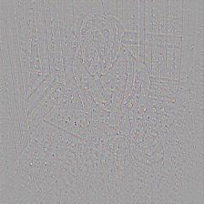             | 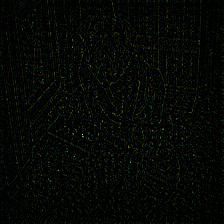             | 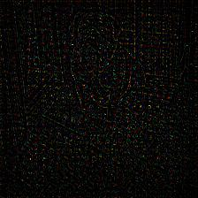             | 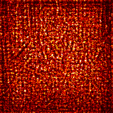             | 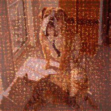             |
|               | 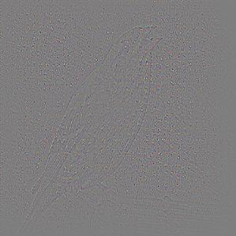           | 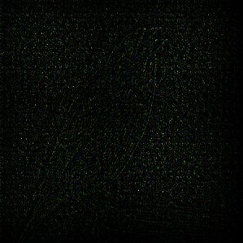           | 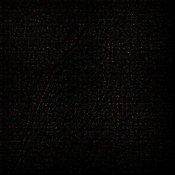           | 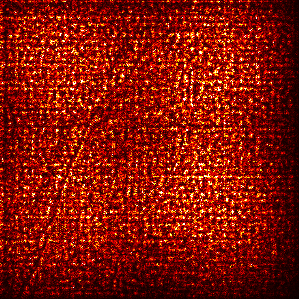           | 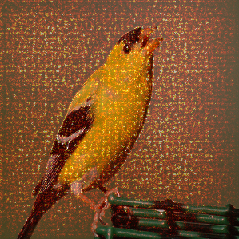           |
|                   | 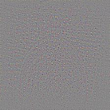                | 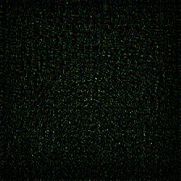                | 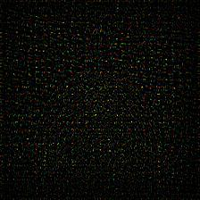                | 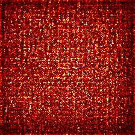                | 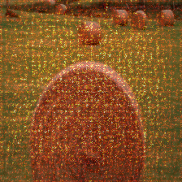                |
|             | 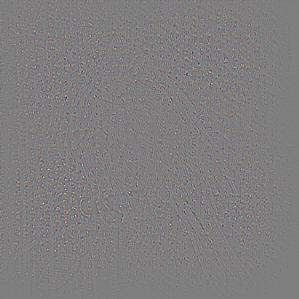         | 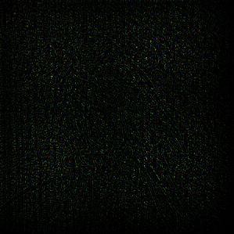         | 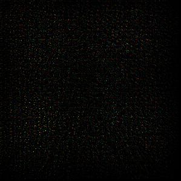         | 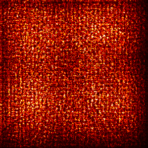         | 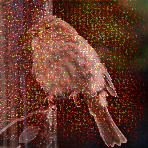         |
|            | 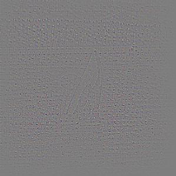        | 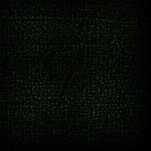        | 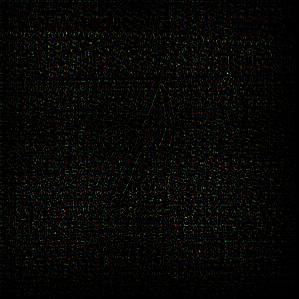        | 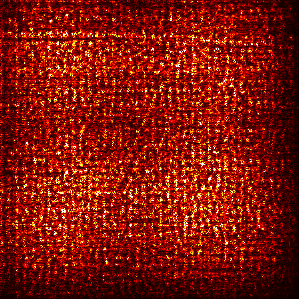        | 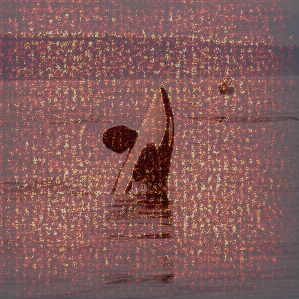        |
|           | 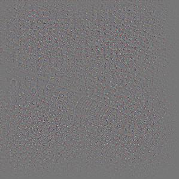       | 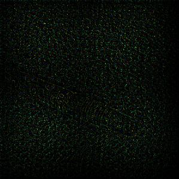       | 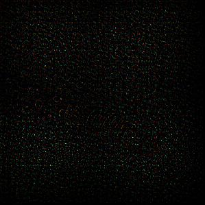       | 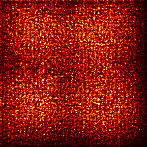       | 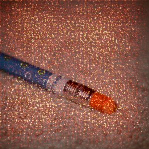       |
|                   | 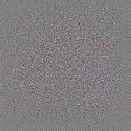               | 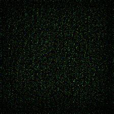               | 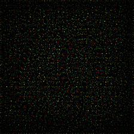               | 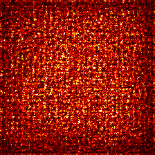               | 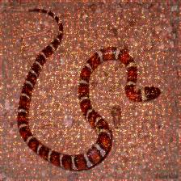               |
|                  | 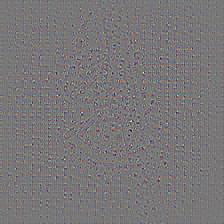              | 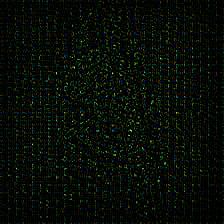              |               |               | 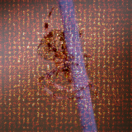              |
|  | 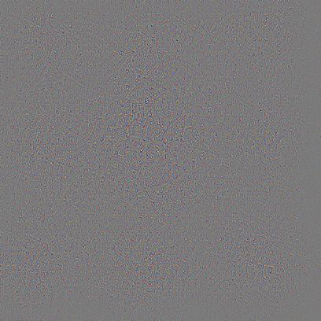 | 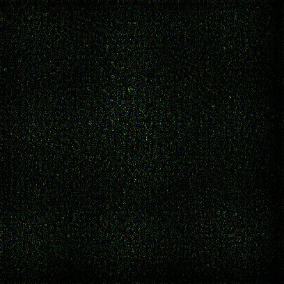 | 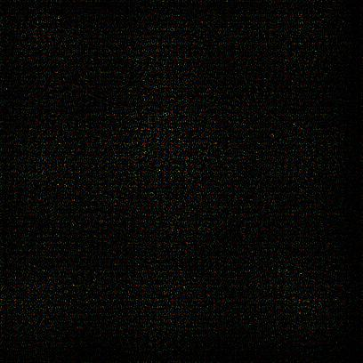 | 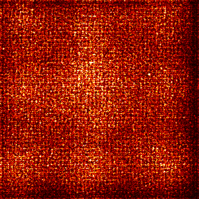 | 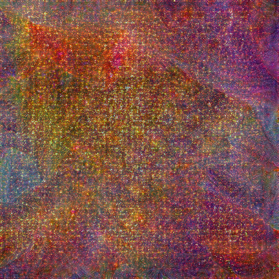 |

##### 3. Evaluation


### Guided Backpropagation

#### Implementation, Result and Evaluation

##### 1. Implementation
##### 2. Result

| Ảnh gốc                                      | Colored Gradient                                                          | Negative Gradient                                                                 | Positive Gradient                                                                 | Heat Map                                                          | Image overlay heat map                                             | 
|----------------------------------------------|---------------------------------------------------------------------------|-----------------------------------------------------------------------------------|-----------------------------------------------------------------------------------|-------------------------------------------------------------------|--------------------------------------------------------------------|
|                 | 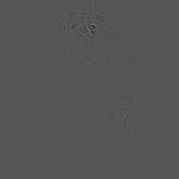             | 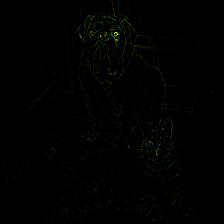             | 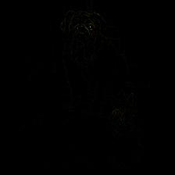             | 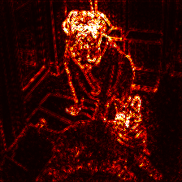             | 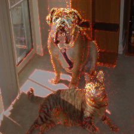             |
|               | 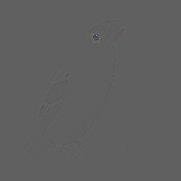           |            | 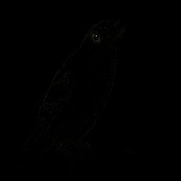           |            |            |
|                   |                 |                 |                 |                 |                 |
|             |          |          |          |          |          |
|            |         |         |         |         |         |
|           |        |        |        |        |        |
|                   |                |                |                |                |                |
|                  |               |               |               |               |               |
|  |  |  |  |  |  |

##### 3. Evaluation


### Comparison between Vanilla Gradient, DeconvNet and Guided Backpropagation

| Ảnh gốc                                      | Vanilla Gradient Results                                             | DeconvNet results                                             | Guided Backpropagation results                                            | 
|----------------------------------------------|----------------------------------------------------------------------|---------------------------------------------------------------|---------------------------------------------------------------------------|
|                 |              |              |              | 
|               |            |            |            |  
|                   |                 |                 |                 | 
|             |          |          |          |  
|            |         |         |         |  
|           |        |        |        | 
|                   |                |                |                |  
|                  |               |               |               | 
|  |  |  |  | 

### Grad-CAM

Grad-CAM cung cấp cách thức để giải thích trực quan cho các quyết định của CNNs. Không giống như các phương pháp khác, 
gradient không phải được backpropagated ngược trở lại input mà thường là đến lớp CNN cuối cùng để tạo ra một bản đồ làm 
nổi bật các vùng quan trọng của hình ảnh.

Grad-CAM là viết tắt của Gradient-weighted Class Activation Map. Như cái tên gọi của nó, nó dựa vào gradient của mạng. 
Grad-CAM, cũng như các kỹ thuật khác gán mỗi một neuron một điểm số liên quan cho quyết định. Quyết định này có thể là 
một dự đoán cho lớp (class) mà ta tìm thấy được trong lớp đầu ra, **nhưng về mặt lý thuyết có thể là bất kỳ lớp nào khác 
trong mạng neuron.** Grad-CAM sao chép thông tin này vào lớp CNN cuối cùng. Grad-CAM có thể được sử dụng với các loại CNNs 
khác nhau: với Fully-connected layers, captioning hoặc là multi-task output, và phục vụ cho việc học tăng cường. 

Mục tiêu của Grad-CAM đó là hiểu được phần nào của ảnh mà một lớp Convolutional layer nhìn vào để đưa ra dự đoán cho một 
lớp cụ thể mà ta đang xét đến. Lớp CNN đầu tiên lấy đầu vào là hình ảnh và đầu ra là bản đồ các tính năng mã hóa mà lớp 
đó đã học được. Các lớp tích chập cao hơn cũng làm tương tự như vậy, nhưng lấy bản đồ tính năng cúa các lớp trước làm đầu 
vào cho lớp đó. Để hiểu cách CNN đưa ra quyết định, Grad-CAM phân tích vùng nào được kích hoạt trong bản đồ tính năng của 
các lớp tích chập cuối cùng. Giả sử ta có k feature maps trong lớp tích chập cuối cùng, ta gọi chúng lần lượt là A_1, A_2, ...
, A_k. Làm thế nào để ta thấy được từ feature maps cách mà CNN đưa ra được quyết định. 

Trong cách tiếp cận đầu tiên, ta đơn giản là visualize giá trị raw của mỗi một feature map, trung bình cộng chúng và sau 
đó đè chúng lên trên ảnh ban đầu của chúng ta. Điều này có thể sẽ không mấy tốt đẹp, bởi vì feature map mã hóa thông tin 
**cho tất cả các lớp**, nhưng chúng ta chỉ muốn một class thôi. Kết quả của ý tưởng này được minh họa bằng bảng kết quả trong 
phần **Result**


Chính vì lý do đó, công việc của Grad-CAM đó là quyết định mức độ quan trọng của từng k feature map đóng góp cho việc phân loại lớp c mà ta mong muốn quan sát. Ta cần phải gán trọng số 
cho mỗi pixel trong mỗi một feature map với lại gradient trước khi ta lấy trung bình cộng theo channel của feature maps.
Điều này sẽ mang lại cho ta một biểu đồ nhiệt highlight được các vùng mà có ảnh hưởng tích cực hoặc tiêu cực đến lớp phân
loại mà ta đang muốn xem xét. Biểu đồ này được gửi vào thông qua hàm ReLU, là một cách để set toàn bộ những giá trị âm về
0 , Grad-CAM loại bỏ những giá trị âm bằng cách sử dụng hàm ReLU, với lập luận rằng chúng ta chỉ quan tâm đến các phần đóng 
góp vào lớp c được chọn chứ không quan tâm đến các phần khác. Chữ pixel có thể gây hiểu nhầm bởi vì feature map được tạo ra 
là nhỏ hơn hình ảnh ban đầu (bởi vì các đơn vị pooling) nhưng được ánh xạ trở lại hình ảnh gốc. Sau đó ta scale Grad-CAM 
về lại khoảng [0, 1] cho mục đích visualize và phủ nó lên hình ảnh ban đầu. 

Công thức của **Grad-CAM** như sau: mục tiêu là tìm map L cho lớp c được định nghĩa như sau: 


Ở đây u là chiều rộng, v là chiều cao của Grad-CAM map và c là class mà ta muốn visualize. Các bước thực hiện như sau:

1. Forward pass ảnh vào thông qua mạng CNN
2. Lấy được score raw của lớp ta muốn visual (có nghĩa là score tại neuron đại diện cho class và ở lớp Pre-softmax)
3. Đặt các giá trị còn lại về 0
4. Thực hiện backpropagate từ lớp ưa thích đó đến trước lớp fully-connected layer:  
5. Đánh trọng số các feature map "pixel" bằng gradient cho mỗi lớp. Chỉ số i, j bên dưới ký hiệu cho chiều rộng và chiều cao:


Điều này có nghĩa là gradient sẽ được tính trung bình cộng (Chia cho Z  = i*j)


6. Tính toán giá trị trung bình cho feature maps, trọng số trên mỗi pixel theo gradient.
7. Áp dụng ReLU vào average feature map
8. Để thực hiện visualization: Scale giá trị vào trong ngưỡng từ 0-1. Upscale heatmap lên và overlay nó lên ảnh nguyên bản
9. Bước tiến hành thêm đối với phương pháp Guided Grad-CAM: nhân heat map với guided backpropagation. 

#### Implementation, Result and Evaluation

##### 1. Implementation
##### 2. Result

| Ảnh gốc                                      | Interested Class                          | Grad-CAM ý tưởng đơn giản                                               | Grad-CAM chuẩn                                            |
|----------------------------------------------|-------------------------------------------|-------------------------------------------------------------------------|-----------------------------------------------------------|
|                 | Tibetan mastiff                           |              |              |
|               | goldfinch, Carduelis carduelis            |            |            |
|                   | hay                                       |                 |                 |
|             | house finch, linnet, Carpodacus mexicanus |          |          |
|            | killer whale                              |         |         |
|           | rubber eraser                             |        |        |
|                   | snake                                     |                |                |
|                  | spider                                    |               |               |
|  | goldfish, Carassius auratus               |  |  |


##### 3. Evaluation


### Guided Grad-CAM

Từ nội dung thuật toán của Grad-CAM, ta có thể thấy rằng heat map cho ra sẽ thô (bởi vì feature map thu được ỏ những lớp
cuối cùng của CNN thì kích thước ảnh sẽ nhỏ đi rất nhiều so với kích thước ảnh ban đầu, và ta phải resize heat map lên 
cho vừa với lại ảnh đầu vào). Ở chiều hướng ngược lại, các kỹ thuật khác sử dụng Gradient được lan truyền ngược đến các 
pixel ảnh đầu vào. Điều này tạo ra hình ảnh có độ chi tiết cao hơn nhiều và có thể hiển thị cho ta được các cạnh hoặc 
các điểm riêng lẻ nào đóng góp nhiều nhất vào dự đoán. Sự kết hợp của cả hai phương pháp được gọi là **Guided Grad-CAM**.
Việc tạo ra nó đơn giản. Ta tính toán cho cả Grad-CAM và kết hợp thêm sự giải thích từ một phương pháp khác, chẳng hạn 
như là Vanilla Gradient. Đầu ra của Grad-CAM sau đó sẽ được Upsample bởi **Bilinear Interpolation**, sau đó cả hai map 
này sẽ được nhân lại với nhau theo kiểu **element-wise**. Grad-CAM sẽ hoạt động giống như một công cụ tập trung vào các 
phần cụ thể của bản đồ phân bổ theo pixel.

#### Implementation, Result and Evaluation

##### 1. Implementation
##### 2. Result

| Ảnh gốc                                      | Interested Class                          | Guided Grad-CAM   (Vanilla + GradCAM)                            | 
|----------------------------------------------|-------------------------------------------|------------------------------------------------------------------|
|                 | Tibetan mastiff                           |              |
|               | goldfinch, Carduelis carduelis            |            | 
|                   | hay                                       |                 | 
|             | house finch, linnet, Carpodacus mexicanus |          | 
|            | killer whale                              |         | 
|           | rubber eraser                             |        | 
|                   | snake                                     |                | 
|                  | spider                                    |               | 
|  | goldfish, Carassius auratus               |  | 

##### 3. Evaluation

### SmoothGrad

Ý tưởng của SmoothGrad được đề xuất bởi [Smilkov et al](https://arxiv.org/abs/1706.03825) nhằm mục đích giảm nhiễu cho
các phương pháp dựa vào gradient-base bằng cách thêm nhiễu và tính trung bình trên các gradient giả này. SmoothGrad không
phải là một phương pháp độc lập, nhưng nó có thể được áp dụng như là bộ mở rộng của các phương pháp dựa vào gradient. 

Luồng thực hiện của **SmoothGrad** như sau:
* Tạo ra nhiều version khác nhau của bức ảnh bằng cách thêm nhiễu vào nó.
* Tạo pixel attribution maps cho toàn bộ những ảnh đó
* Trung bình cộng toàn bộ các pixel attribution maps đó

Ý tưởng để thực hiện là đơn giản. Tại sao việc này lại hữu ích? Lý thuyết là đạo hàm dao động rất lớn ở quy mô nhỏ. Mạng 
neuron không có động lực trong quá trình huấn luyện để giữ cho gradient mượt, mục tiêu của chúng là phân loại hình ảnh 
một cách chính xác. Việc tính trung bình trên nhiều bản thể sẽ "giải quyết" được những biến động này.


Với g_i là noise vector với chuẩn Gaussian distribution. Mức độ noise thích hợp sẽ phụ thuộc vào hình ảnh đầu vào và kiến trúc 
mạng. Tác giả đề xuất mức độ nhiễu ở mức 10%-20%, điều đó có nghĩa là ```sigma/(x_max - x_min)``` nên nằm trong khoảng 0.1 
và 0.2. Cận x_min và x_max có nghĩa là minimum và maximum pixel values của tấm ảnh. Tham số còn lại là số lượng mẫu được
tạo ra (n), giá trị này được đề xuất sử dụng là 50.

#### Implementation, Result and Evaluation

##### 1. Implementation
##### 2. Result

| Ảnh gốc                             | sigma = a / (x_min - x_max) | Vanilla Grad + SmoothGrad                            | 
|-------------------------------------|-----------------------------|------------------------------------------------------|
|      | a = 0...5                   |        | 
|          | a = 0...5                   |                | 
|        | a = 0...5                   |                    | 
|         | a = 0...5                   |              | 
|          | a = 0...5                   |                    | 
|    | a = 0...5                   |      | 
|   | a = 0...5                   |    | 
|  | a = 0...5                   |  | 
 

##### 3. Evaluation 


### Layer-Wise Relevance Propagation (LRP)

#### Implementation, Result and Evaluation

##### 1. Implementation
##### 2. Result

| Ảnh gốc                                      | Interested Class                          | LRP Results                             | 
|----------------------------------------------|-------------------------------------------|-----------------------------------------|
|                 | Tibetan mastiff                           |          |
|               | goldfinch, Carduelis carduelis            |    | 
|                   | hay                                       |          | 
|             | house finch, linnet, Carpodacus mexicanus |   | 
|            | killer whale                              |  | 
|           | rubber eraser                             |       | 
|                   | snake                                     |        | 
|                  | spider                                    |       | 
|  | goldfish, Carassius auratus               |         | 

##### 3. Evaluation


### Though

Một vấn đề lớn cho tất cả những phương pháp này đó là ta không có xác định được **ground truth** cho các giải thích này. 
Chúng ta chỉ mới ở trong bước đầu loại bỏ những giải thích mà rõ ràng là không có ý nghĩa (và ngay cả trong bước này, ta
cũng không có được sự khẳng định mạnh mẽ, quá trình đưa ra dự đoán trong mạng neuron là rất phức tạp !!!)


### Advantages 

Sự giải thích bằng những phương pháp này là trực quan và ta có thể nhanh chóng nhận ra hình ảnh. Đặc biệt, khi các phương 
pháp chi làm nổi bật các điểm ảnh quan trọng, ta có thể dễ dàng nhận ra ngay các vùng quan trọng của ảnh. 

Các phương pháp dựa trên Gradient thường tính toán nhanh hơn các phương pháp bất khả tri theo mô hình. Ví dụ: LIME và SHAP 
cũng có thể giải thích cho sự phân loại hình ảnh của mạng neuron, nhưng quá trình tính toán thì mất rất nhiều tài nguyên. 

Ta có nhiều phương pháp visual để mà lựa chọn

### Disadvantages 

Với hầu hết các phương pháp giải thích, rất khó để biết liệu nó có đúng hay không và phần lớn trong quá trình đánh gía 
chỉ mang tính chất định tính ("Những giải thích này có vẻ đúng, hãy xuất bản bài báo" mà chưa có cách để đánh giá bằng 
số liệu cho những phương pháp giải thích như trên)

Các phương pháp liên quan đến **Pixel Attribution** có thể rất dễ bị phá vỡ. [Ghorbani et al.](https://arxiv.org/pdf/1710.10547.pdf) 
chỉ ra rằng việc đưa ra những nhiễu loạn nhỏ (adversarial) đối với một hình ảnh vẫn dẫn đến cùng một dự đoán, nhưng **saliency map** 
được tạo ra để chứng minh cho dự đoán là rất khác nhau !!!

[Kinderman et al.](https://arxiv.org/pdf/1711.00867.pdf) cũng chứng minh được các phương pháp dựa vào **pixel attribution** 
là không đáng tin cậy. Họ thêm một lượng shift constant vào ảnh input, có nghĩa là thêm một lượng thay đổi bằng nhau vào
toàn bộ pixel ảnh. Họ so sánh hai mạng networks, mạng network đầu tiên và phiên bản "shifted" của nó (toàn bộ bias của 
lớp đầu tiên được thay đổi để có thể adapt được đối với lại constant pixel shift). Cả hai mạng networks đều cho ra dự 
đoán như nhau. Hơn nữa, gradient là tương đương nhau đối với cả hai mạng này. Nhưng **Saliency Map** lại khác nhau, đó 
là một tính chất rất không mong đợi. Họ tested với các phương pháp visual: **DeepLift**, **Vanilla Gradient** và **Integrated Gradient**

Bài báo [Sanity checks for saliency maps](https://arxiv.org/pdf/1810.03292.pdf) nghiên cứu xem các phương pháp **Saliency**
có insensitive đối với mô hình hay dữ liệu hay không. Sự vô cảm (insensitivity) là điều rất không mong muốn, bởi vì nó có nghĩa 
là sự giải thích không liên quan đến mô hình và dữ liệu. Các phương pháp mà insensitive với mô hình và dữ liệu training tương tự như 
những bộ edge detectors vậy. Bộ phát hiện cạnh chỉ đơn giản là làm nổi bật những màu sắc pixel mạnh trong hình ảnh và không 
liên quan đến mô hình dự đoán hoặc các tính năng trừu tượng của hình ảnh và không cần quá trình huấn luyện. Các phương pháp 
**Pixel attributions** được thử nghiệm là **Vanilla Gradient**, **Gradient x Input**, **Integrated Gradients**, **Guided Backpropagation**, 
**Guided Grad-CAM** và **SmoothGrad + Vanilla Gradient**. Vanilla Gradient và Grad-CAM đã vượt qua bài kiểm tra độ nhạy, trong 
khi Guided Backpropagation và Guided Grad-CAM thì lại không vượt qua. Tuy nhiên, bản thân tờ báo đã nhận một số lời chỉ trích 
từ [Tomsett et al.](https://arxiv.org/pdf/1912.01451.pdf). Họ nhận thấy rằng có sự thiếu nhất quán đối với các chỉ số đánh 
giá, vì vậy chúng ta trở lại nơi chúng ta bắt đầu ... Vẫn còn tồn đọng việc khó khăn để đánh giá các phương pháp **visual explanations** này.

Nói chung đây là một trạng thái rât không hài lòng. Chúng ta phải chờ đợi các nghiên cứu thêm về chủ đề này. Và đừng phát minh ra thêm bất kỳ phương pháp 
**Saliency** nào nữa mà hãy tập trung vào câu hỏi **"Làm thế nào để đánh giá chúng ?!!"**


## Detecting Concepts

Ở phần trên, ta đã gặp được các phương thức được sử dụng để giải thích **black box models** thông qua sự phân bố tính năng (feature attribution).
Tuy nhiên, có một vài hạn chế liên quan đến cách tiếp cận dựa vào feature này. Đầu tiên, các features mà mô hình học được 
**không nhất thiết phải thân thiện với người dùng về mặt diễn giải bằng hình ảnh**. Ví dụ: tầm quan trọng của một pixel 
trong một hình ảnh thường không truyền đạt nhiều ý nghĩa diễn giải. 
Thứ hai khả năng giải thích dựa vào feature nó giới hạn trong khuôn khổ số lượng các features mà kiến trúc model có. 

Cách tiếp cận dựa trên khái niệm (**Concept-based**) nhằm giải quyết cả hai hạn chế nêu trên. Một khái niệm có thể là bất 
kỳ sự trừu tượng nào, chẳng hạn như màu sắc, một đối tượng hoặc thậm chí là một ý tưởng. Với bất kỳ khái niệm nào do người 
dùng xác định, mặc dù mạng neuron có thể không được đào tạo rõ ràng với các khái niệm đã cho, nhưng phương pháp dựa trên khái 
niệm sẽ phát hiện rằng khái niệm đó được nhúng trong không gian tiềm ẩn (latent space) mà mạng neuron học được. Nói cách 
khác, cách tiếp cận dựa trên khái niệm có thể tạo ra các giải thích không bị giới hạn bởi không gian đặc trưng của mạng neuron (features).

Trong phần này, ta sẽ tập trung chính vào phương pháp **Testing with Concept Activation Vectors** (TCAV) của [Kim et al.]() 

### TCAV: Testing with Concept Activation Vectors 

TCAV được đề xuất là sẽ tạo ra các giải thích toàn cục cho mạng neuron, nhưng trong lý thuyết, nó cũng sẽ hoạt động cho bất kỳ 
mô hình nào có thể lấy đạo hàm định hướng được. Đối với bất kỳ khái niệm nhất định nào, TCAV đo lượng mức độ ảnh hưởng của khái 
niệm đó đối với dự đoán của mô hình cho một class dự đoán nhất định. Ví dụ: TCAV có thể trả lời các câu hỏi như khái niệm "có sọc"
ảnh hưởng như thế nào đến mô hình phân loại hình ảnh và cho ra là "ngựa vằn". Vì TCAV mô tả mối quan hệ giữa một khái niệm với một 
class, thay vì giải thích một dự đoán duy nhất, nó cung cấp cách diễn giải hữu ích trên phạm vi toàn cục của mô hình. 

#### Concept Activation Vector (CAV) 

Một CAV đó là sự biểu diễn số học cho phép tổng quan một khái niệm trong không gian kích hoạt (activation space) của một lớp mạng neuron. 
Một CAV, ký hiệu , phụ thuộc vào khái niệm C và lớp mạng neuron l, với 
l được gọi là nút cổ chai (bottleneck) của mô hình [?](https://stats.stackexchange.com/questions/262044/what-does-a-bottleneck-layer-mean-in-neural-networks).
Để tính toán được giá trị CAV của một khái niệm C. Đầu tiên, ta phải chuẩn bị 2 bộ dữ liệu: Một bộ dữ liệu mô tả cho khái niệm C (concept dataset) và một bộ 
dữ liệu ngẫu nhiên bao gồm dữ liệu tùy ý. Ví dụ, để định nghĩa cho khái niệm "có sọc", ta có thể thu thập những tấm ảnh có sọc là ảnh trong bộ **concept dataset**, trong 
khi đó bộ dữ liệu ngẫu nhiên còn lại là nhóm các ảnh ngẫu nhiên không chứa sọc. Tiếp theo đó, ta nhắm vào một lớp ẩn l của model và huấn luyện 
bộ phân loại nhị phân (binary classifier) cho phép chia mức kích hoạt được tạo ra bởi khái niệm tập hợp từ những khái niệm được tạo ra bởi tập hợp ngẫu nhiên. 
Vector hệ số của bộ phân loại nhị phân này được gọi là CAV . Trong thực tế ta có thể sử dụng SVM hoặc là một 
mô hình hồi quy logistic như là một bộ phân loại nhị phân. Cuối cùng, cho trước một ảnh input x, ta có thể đo được "độ nhạy khái niệm" (conceptual sensitivity) bằng cách tính **đạo hàm có hướng** (directional derivative)
của hàm dự đoán theo hướng của đơn vị CAV. 

 

Xem đạo hàm có hướng của hàm có đạo hàm tại x [tại đây](https://en.wikipedia.org/wiki/Directional_derivative#:~:text=In%20mathematics%2C%20the%20directional%20derivative,a%20velocity%20specified%20by%20v.)

Các ký hiệu ở đây có nghĩa như sau:  biến đổi ảnh đầu vào x sang vector kích hoạt tại lớp l và  biến đổi vector kích 
hoạt sang logit output của class k. 

Theo toán học, dấu của  chỉ phụ thuộc vào góc giữa gradient của  và . Nếu 
góc này vượt quá 90 độ, thì giá trị  sẽ dương, và ngược lại nếu nhỏ hơn 90 độ, thì giá trị của  là âm. Bởi vì gradient 
 sẽ chỉ đến hướng mà cực đại hàm đầu ra nhanh nhất, còn độ nhạy khái niệm , thì nó chỉ ra rằng có phải 
 cũng đang chỉ đến hướng cực đại hàm kích hoạt  biến đổi ảnh đầu vào x sang vector kích hoạt tại lớp l và 
. Do đó, nếu như giá trị sensitive  >0 có nghĩa là khái niệm C đang ủng hộ cho model phân loại ảnh x thuộc vào lớp k. 


#### Testing with CAVs (TCAV)

Ở phần trên, ta học cách tính toán giá trị độ nhạy đối với khái niệm (conceptual sensitivity) của một điểm dữ liệu. Tuy nhiên mục tiêu của ta là tạo ra một đánh giá mang tính tổng quát (global explanation) 
tức là chỉ ra giá trị tổng quát cho toàn bộ lớp. Một các tiếp cận tổng quát được áp dụng trong TCAV đó là tính toán tỉ lệ 
đầu vào cho độ nhạy khái niệm giá trị dương với tổng số lượng đầu vào cho một lớp. 

 0|}{|X_k|}">

Quay trở lại với ví dụ, ta mong muốn xem thử cái khái niệm "có sọc" ảnh hưởng như thế nào đến mô hình khi mà nó cho ra 
quyết định là "ngựa vằn". Ta thu thập dữ liệu được đánh nhãn là "ngựa vằn". Và tính toán giá trị conceptual sensitivity cho mỗi 
ảnh đầu vào. Sau đó giá trị TCAV của khái niệm "sọc" với dự đoán "ngựa vằn" được tính bằng số ảnh "ngựa vằn" đầu vào có giá trị 
conceptual sensitivities là dương chia cho tổng số ảnh "ngựa vằn". Nói cách khác, giá trị TCAV với C=Sọc và k=Ngựa vằn mà bằng 0.8 có nghĩa là 
80% dự đoán cho lớp "ngựa vằn" là bị ảnh hưởng tích cực bởi khái niệm "sọc". 

Điều này thật tuyệt, nhưng làm cách nào ta có thể biết được giá trị TCAV là có ý nghĩa ? Sau tất cả, CAV là vector được huấn luyện bởi người dùng chọn dữ liệu cho khái niệm và dữ liệu ngẫu nhiên. 
Nếu mà dữ liệu được sử dụng để huẩn luyện CAV mà tệ, thì sự giải thích bằng số liệu ở trên là vô nghĩa. Do đó, ta cần thực hiện bài kiểm tra ý nghĩa thông kê đơn giản để giúp cho TCAV trở nên đáng 
tin cậy hơn. Nghĩa là thay vì chỉ đào tạo một CAV, ta đào tạo hàng loạt CAVs bằng cách sử dụng các bộ dữ liệu ngẫu nhiên trong khi giữ nguyên bộ concept dataset. Một khái niệm có ý nghĩa nên tạo ra được CAV với điểm 
TCAV nhất quán. Quy trình kiếm tra được trình bày như sau: 
1. Thu thập N mẫu dữ liệu ngẫu nhiên, và gía trị N được khuyến nghị là 10. 
2. Cố định bộ dữ liệu khái niệm và tính toán giá trị TCAV sử dụng mỗi ảnh trong N ảnh random vừa chọn ra.
3. Áp dụng [two-sided t-test](https://wiki2.org/en/Student%27s_t-test) giữa N TCAV tạo ra bởi random data này với N TCAV tạo ra bởi cùng một random CAV. Một random CAV có thể có được bằng cách chọn random dataset as the concept dataset ???

Ta cũng nên áp dụng phương pháp hiệu chỉnh nhiều thử nghiệm ở đây nếu ta có nhiều giả thuyết. Bài báo gốc sử dụng hiệu chỉnh Bonferroni, và ở đây số lượng giả thuyết bằng số lượng khái niệm ta đang thứ nghiệm. 

### Example 

Xem ví dụ về TCAV trên [Github](https://github.com/tensorflow/tcav/blob/master/Run_TCAV.ipynb). Tiếp tục lấy ví dụ về lớp 
"ngựa vằn" mà ta đề cập ở phía trên, ví dụ này cho thấy kết quả của các điểm TCAV cho các khái niệm "sọc", "zigzagged" và "dotted". Bộ phân loại hình ảnh đang sử dụng đó là InceptionV3 - một mạng cnn được huấn luyện sử dụng dữ liệu ImageNet.
Mỗi loại dữ liệu concept và random data đều chứa 50 tấm ảnh, và ta sử dụng 10 tập random dataset cho kiểm định ý nghĩa thống kê với mức ý nghĩa 0.05. Ta không sử dụng hiệu chỉnh Bonferroni, bởi vì ta chỉ có một vài tập dữ liệu ngẫu nhiên, nhưng 
trong thực tế nên áp dụng thêm nó để tránh phát hiện sai. 

Trong thực tế, ta nên sử dụng nhiều hơn 50 tấm ảnh trong mỗi loại dữ liệu để có thể train các CAVs tốt hơn. Ta cũng nên sử dụng nhiều hơn 10 tập random để có thể có được statistical significance tests tốt hơn. Ta cũng có thể áp dụng TCAV đối với 
nhiều bottlenecks để có thể có thêm nhiều mức độ quan sát khác nhau. 

#### Perform TCAV 

Mình sẽ sử dụng Captum của Pytorch để thực hiện TCAV, chi tiết xem ở đây

## References
[1] [Feature Visualization Implementation using FastAI](https://towardsdatascience.com/how-to-visualize-convolutional-features-in-40-lines-of-code-70b7d87b0030)

[2] [Feature Visualization Distill pub](https://distill.pub/2017/feature-visualization/)

[3] [Interpretable Machine Learning](https://christophm.github.io/interpretable-ml-book/)


## TODO: 
- [ ] Cập nhật code 1 lần/tuần. Chi tiêt cập nhật được ghi lại đầy đủ ở bên dưới:
  - [x] Ngày 03/07/2022: Viết lại phần code cho `DeconvNet` và chạy test.
  - [x] Ngày 11/07/2022: Viết lại phần code cho `Grad-CAM` và chạy test. 
  - [x] Ngày 21/07/2022: Viết lại phần code cho `Guided Backpropagation` và chạy test. 
  - [ ] Ngày 02/08/2022: Viết lại phần code cho 